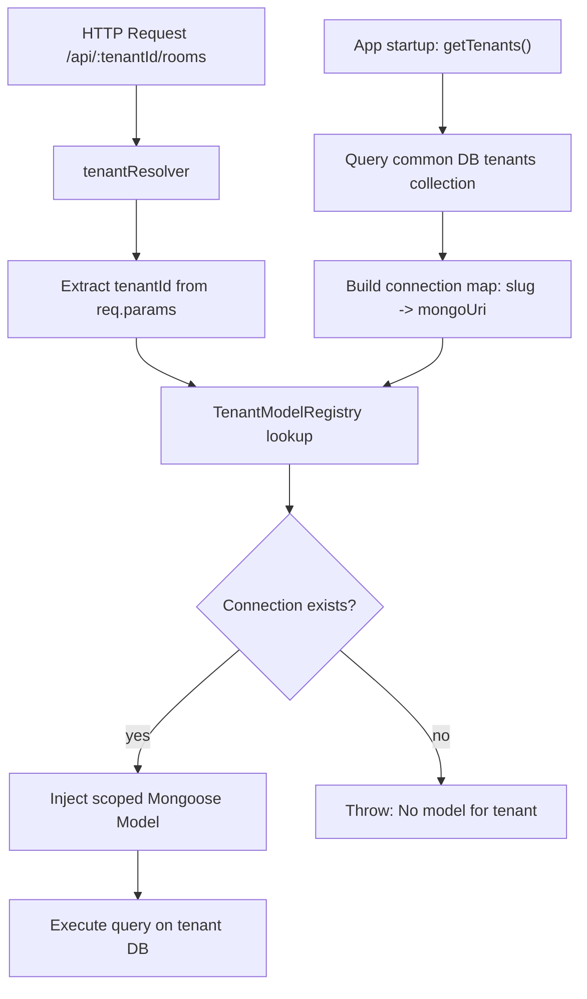
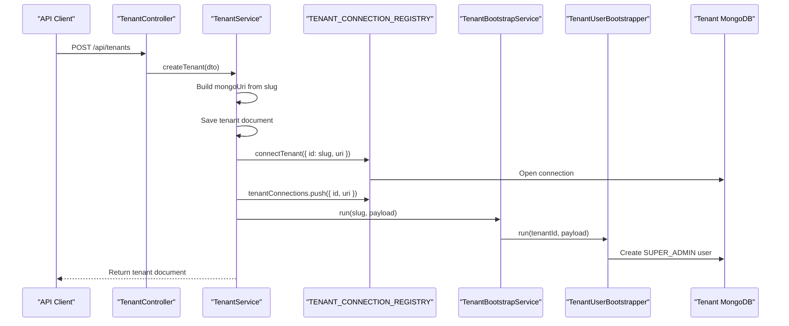
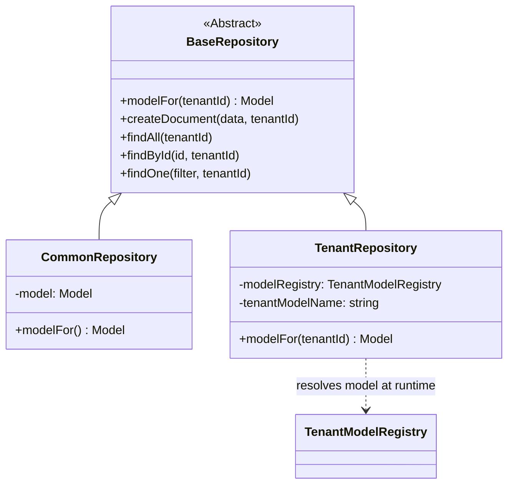

# Workspaces SaaS

A multi-tenant platform for managing physical workspaces, rooms, inventory, and bookings.

## Table of Contents

* [Why This Exists](#why-this-exists)
* [Tech Stack](#tech-stack)
* [Features](#features)
* [Installation](#installation)
* [Usage](#usage)

  * [Create a Tenant](#create-a-tenant)
  * [Authenticate as a Tenant User](#authenticate-as-a-tenant-user)
* [Multi-Tenancy](#multi-tenancy)

  * [The Two Database Contexts](#the-two-database-contexts)
  * [Runtime Tenant Registration](#runtime-tenant-registration)
  * [Tenant Provisioning Sequence](#tenant-provisioning-sequence)
  * [Repository Pattern](#repository-pattern)
* [Known Limitations](#known-limitations)
* [Contributing](#contributing)
* [License](#license)

## Why This Exists

Most workspace management tools are single-tenant. This project is designed as a SaaS platform where each workspace operator receives:

* An isolated MongoDB database
* Separate users and permissions
* Independent business data

All tenants run from a single application deployment.

## Tech Stack

### Backend

* NestJS
* Mongoose
* Passport.js
* JWT

### Frontend

* Vue 3
* Vite
* Tailwind CSS
* shadcn-vue

### Database

* MongoDB 7
* One shared common database
* One dedicated database per tenant

### Infrastructure

* Docker
* Docker Compose
* Nginx

## Features

* **Database-per-tenant isolation** — each workspace receives its own MongoDB database rather than sharing collections with filters.
* **Room management** — create and manage bookable rooms.
* **Session and reservation tracking** — track active sessions and future bookings.
* **Catalog and inventory management** — manage workspace products and inventory.
* **Customer management** — maintain tenant-specific customer records.
* **Role-based access control** — support roles such as `SUPER_ADMIN` and staff scoped to a tenant.
* **Runtime tenant provisioning** — create and activate tenants without restarting the application.

## Installation

Copy the environment file and start the stack using Docker Compose.

```bash
cp .env.example .env

# Edit .env and configure secrets and ports
docker compose up
```

The frontend is available at `http://localhost` (served through Nginx on port 80).

The backend API runs on the port specified by `BACKEND_PORT`.

### Local Development

For local development without Docker:

```bash
# Requires tmuxp
tmuxp start -p .tmux.dev.yml
```
or using the docker-compose.dev.yml

## Usage

### Create a Tenant

```bash
curl -X POST http://localhost/api/tenants \
  -H "Content-Type: application/json" \
  -d '{
    "name": "Acme Workspace",
    "slug": "acme",
    "adminName": "Jane Doe",
    "adminEmail": "jane@acme.com",
    "adminPassword": "securepassword"
  }'
```

This process:

1. Creates a tenant record in the common database.
2. Opens a MongoDB connection to `mongodb://mongodb:27017/acme`.
3. Seeds a `SUPER_ADMIN` user into the tenant database.

No server restart is required.

### Authenticate as a Tenant User

```bash
curl -X POST http://localhost/api/acme/auth/login \
  -H "Content-Type: application/json" \
  -d '{"email":"jane@acme.com","password":"securepassword"}'
```

All tenant-specific routes follow this pattern:

```text
/api/:tenantId/...
```

Where `tenantId` is the tenant slug.

---

# Multi-Tenancy

This is the core architectural feature of the system.

## The Two Database Contexts

The application operates with two separate database layers:

### Common Database

Configured via `MONGO_COMMON_URI`.

Stores:

* Tenant metadata
* Platform administrators
* Tenant registry information

### Tenant Databases

Configured dynamically using:

```text
MONGO_BASE_URI/<slug>
```

Each tenant receives an independent MongoDB database.

No tenant data is shared at the storage layer.



## Runtime Tenant Registration

The `@phen0menon/nestjs-mongoose-tenancy` package loads tenant connections during application startup.

While this works for static tenants, newly created tenants would normally require an application restart.

To support runtime provisioning, `TenantService.createTenant()` updates the connection registry immediately after creating the tenant:

```ts
await this.connectionRegistry.connectTenant({
  id: dto.slug,
  uri: mongoUri,
});

this.connectionRegistry.tenantConnections.push({
  id: dto.slug,
  uri: mongoUri,
});
```

These operations serve different purposes:

* `connectTenant()` opens the Mongoose connection and registers models.
* `tenantConnections.push()` updates the library's internal registry.

Both are required for immediate tenant availability.

The `TenantRepository.modelFor()` method resolves models dynamically on every call:

```ts
protected modelFor(tenantId: string): Model<T> {
  const model = this.modelRegistry
    .getModelMap<T>(this.tenantModelName)
    .get(tenantId);

  if (!model) {
    throw new Error(`No model for tenant "${tenantId}"`);
  }

  return model;
}
```

This guarantees newly registered tenants are visible without restarting the application.

## Tenant Provisioning Sequence



## Repository Pattern

Data access is implemented through a three-layer repository hierarchy.

### BaseRepository

Defines the common repository contract.

### CommonRepository

Uses a fixed model bound to the shared database.

### TenantRepository

Resolves tenant-specific models dynamically at runtime.



Examples:

* `TenantService`
* `CommonUserService`

extend `CommonRepository`.

Examples:

* `UserService`
* `RoomService`

extend `TenantRepository` and receive `tenantId` from route parameters.

---

## Known Limitations

### Tenant Deletion

Deleting a tenant removes the registry record but does not delete the tenant database.

Database cleanup must currently be performed manually.

### Internal Library Mutation

The following line mutates internal library state:

```ts
this.connectionRegistry.tenantConnections.push(...)
```

While effective, it depends on implementation details of `@phen0menon/nestjs-mongoose-tenancy`.

Pin the package version you have validated.

### Connection Scaling

Each tenant maintains an active Mongoose connection.

Hundreds of tenants may result in hundreds of open connections.

This is acceptable for smaller deployments but should be revisited before large-scale production use.

### Cross-Tenant Reporting

Database-per-tenant isolation makes cross-tenant analytics and reporting more complex and expensive.

## License

MIT
